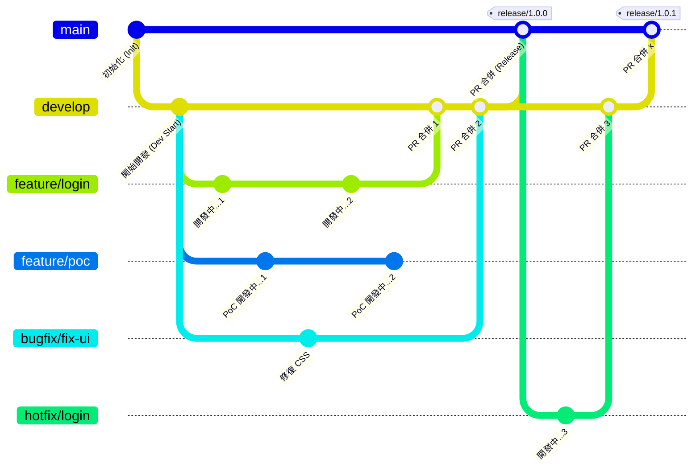

# 開發流程圖 (Development Workflow)

這張圖展示了從開發到上線的完整路徑。

```mermaid
gitGraph
   commit id: "初始化 (Init)"
   branch develop
   checkout develop
   commit id: "開始開發 (Dev Start)"
   
   checkout develop
   branch feature/login
   checkout feature/login
   commit id: "開發中...1"

   checkout develop
   branch feature/poc
   checkout feature/poc
   commit id: "PoC 開發中...1"

   checkout develop
   branch bugfix/fix-ui
   checkout bugfix/fix-ui
   commit id: "修復 CSS"


   checkout feature/login
   commit id: "開發中...2"

   checkout feature/poc
   commit id: "PoC 開發中...2"


   checkout develop
   merge feature/login id: "PR 合併 1"
   
   checkout develop
   merge bugfix/fix-ui id: "PR 合併 2"
   
   checkout main
   merge develop id: "PR 合併 (Release)" tag: "release/1.0.0"

   checkout main
   branch hotfix/login
   checkout hotfix/login
   commit id: "開發中...3"

   checkout develop
   merge hotfix/login id: "PR 合併 3"

   checkout main
   merge develop id: "PR 合併 x" tag: "release/1.0.1"

```
