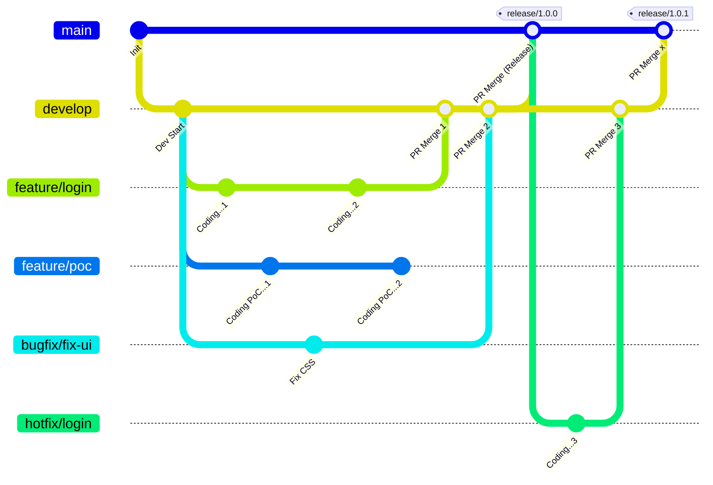

# Development Workflow

This diagram shows the complete path from development to release.

```mermaid
gitGraph
   commit id: "Init"
   branch develop
   checkout develop
   commit id: "Dev Start"
   
   checkout develop
   branch feature/login
   checkout feature/login
   commit id: "Coding...1"

   checkout develop
   branch feature/poc
   checkout feature/poc
   commit id: "Coding PoC...1"

   checkout develop
   branch bugfix/fix-ui
   checkout bugfix/fix-ui
   commit id: "Fix CSS"


   checkout feature/login
   commit id: "Coding...2"

   checkout feature/poc
   commit id: "Coding PoC...2"


   checkout develop
   merge feature/login id: "PR Merge 1"
   
   checkout develop
   merge bugfix/fix-ui id: "PR Merge 2"
   
   checkout main
   merge develop id: "PR Merge (Release)" tag: "release/1.0.0"

   checkout main
   branch hotfix/login
   checkout hotfix/login
   commit id: "Coding...3"

   checkout develop
   merge hotfix/login id: "PR Merge 3"

   checkout main
   merge develop id: "PR Merge x" tag: "release/1.0.1"

```
